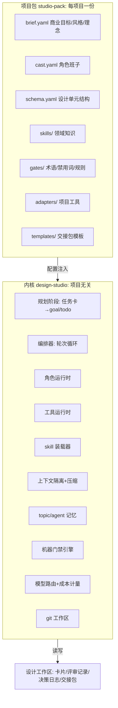

<!--
Project: my-ft
Created Date: 2026-06-12
Author: liming
Email: lmlala@aliyun.com
Copyright (c) 2025 FiuAI
-->

# 01 — 架构：内核 / 项目包 / 工作区

## 1. 总体分层



**复用的实现方式就一句话：内核只认识 schema，不认识游戏。**
「事件系统卡片」对内核而言只是「一个有五个必填字段、处于 draft 状态、
有 3 个依赖的设计单元」。换项目 = 换包，内核零改动（README §6 铁律）。

当前实现已拆成七个子包：`core/llm/roles/skills/context/memory/loop`。
工程事实以 [`../studio/architecture.md`](../studio/architecture.md) 为准；
本文件保留长期蓝图和后续演进方向。

## 2. 项目包规范（输入面）

### 2.1 brief.yaml — 你说的「输入商业目标、风格、理念、系统模块」

```yaml
project: my-ft
version: 1
business:                       # 商业目标 (批判者「商业」角色的依据)
  positioning: "RimWorld式足球更衣室故事生成器"
  market_window: "FM26口碑崩盘窗口期; 无直接竞品"
  audience_personas:            # 同时是「模拟用户」角色的实例化来源
    - id: fm_fatigued
      name: "FM叙事疲劳玩家"
      wants: ["球员像人", "事件不模板化"]
      fears: ["又是表格地狱"]
    - id: system_narrative      # ... 四画像逐个结构化
  success_metrics: ["战报可复述性>=3.8/5", "首小时记住3个人物"]
  constraints: ["个人副业", "无美术", "买断制单机", "预算上限/月"]
style:                          # 风格与理念 (一致性批判者的依据)
  tone: "现实规则+架空世界+黑色幽默"
  principles_ref: "topis/football-docs/00-design-card-spec.md#全局原则"  # G1-G10
  glossary_ref: "topis/football-docs/00-design-card-spec.md#术语表"
modules:                        # 系统模块清单 (Phase 1 分解的骨架)
  - {id: narrative-director, doc: "topis/football-docs/03-narrative-director.md"}
  - {id: event-system, doc: "topis/football-docs/05-event-system.md"}
  # ...
evaluation:                     # 外部证据源 (工具适配器的指向)
  sim_runner: "adapters/sim_run.py"
  metrics_source: "runs/baseline/"
```

要点：brief 是**结构化数据不是散文**——角色 prompt 按字段引用它；
新项目的接入成本 = 认真填一份 brief（这本身就是有价值的产品思考）。

每个项目同时维护一份**人读总览**（my-ft 为
`topis/football-docs/00a-game-overview.md`，≤2k token，agent 常驻上下文第一项）：
brief.yaml 是它的机读提炼，二者冲突时以人读总览为准并同步 brief。

### 2.2 schema.yaml — 设计单元结构（内核唯一认识的「形状」）

```yaml
unit_type: design_card
id_pattern: "[A-Z]+-[0-9]{2}"
status_machine: [draft, in_review, refined, reviewed, locked, frozen]
fields:
  - {name: 目的, required: true}
  - {name: 设计理念, required: true}
  - {name: 如何设计, required: true, min_items: 3}
  - {name: 验收标准, required: true, lint: decidable}   # 禁用词检查
  - {name: 评估钩子, required: true}
meta: {优先级: [P0, P1, P2], 依赖: id_list, stake: [high, normal, low]}
```

my-ft 的 schema 就是 00 卡片协议的机读版；效率 app 项目可以定义
`feature_spec`（用户故事/交互流/数据需求/验收/埋点）——字段不同，
内核处理逻辑相同。

## 3. 工作区与数据模型

工作区 = git 仓库内的约定目录，**一切状态都是文件**（无数据库——
可审计、可回滚、重启零损失，延续 14 号文档的决策）：

```text
work/
├── runs/<run_id>/
│   ├── plan.json       # 规划阶段产物: goal/todos/constraints/risks
│   ├── journal.jsonl   # skill 装载/拒绝、阶段事件
│   └── report.md       # 运行报告
├── reviews/<card>/     # 评审记录: round-<n>.json
├── steering/<card>.md  # 人工方向注入
├── memory/
│   ├── agent.jsonl     # agent 自身经验
│   └── topics/*.jsonl  # topic 级记忆
├── .cache/llm/         # LLM 响应缓存
└── ledger.jsonl        # 成本台账
```

设计单元文件 = YAML front-matter（机读元数据）+ markdown 正文
（人读内容）。front-matter 示例：

```yaml
---
id: DIR-04
status: in_review
stake: high
deps: [DIR-01, WV-05]
round: 2
scores: {商业: 4, ux: 3, 技术: 4, 心理: 4, 一致性: 5}   # 最近一轮
open_issues: [I-117, I-121]
revision: 7
---
```

**评审记录是一等公民**：每轮的全部角色发言、裁决、diff 摘要存档为
JSON——这是框架自我改进的训练数据（哪个角色的批判被采纳率高、
哪类 issue 反复出现），也是新角色/新 skill 的回归测试集。

## 4. 状态机（在 00 协议基础上扩展）

```text
draft ──提交评审──► in_review ──主编判收敛──► refined ──人工──► reviewed ──实现验收──► locked
  ▲                    │ 轮次上限/振荡/分数不升                      │
  └──评估证伪/人工打回──┴────────► frozen (needs-human) ◄────────────┘
```

- `in_review` 是新增状态：单元正在多轮循环中，agent 不并发修改；
- `frozen` 单元不再被调度，出现在你的晨检清单顶端；
- 状态迁移全部由内核执行并写 git commit（角色只能建议，无直接写权）。

## 5. 编排器

当前执行顺序已经固定为“先规划、再轮次”：

```text
load task -> select cards -> PlanningService -> plan.json
          -> ContextBuilder(role_view) -> CardRunner
          -> memory/report/ledger
```

- **规划阶段**：goal 默认由规划者读任务卡、目标卡片清单和 topic 记忆分析
  得出；任务 YAML 的 `goal:` 只是人工覆盖；dry-run 走 fallback，不调 LLM；
- **todo 状态机**：`pending -> in_progress -> done/skipped` 只由内核推进；
  模型只能提出 `focus`，不能决定状态；
- **角色隔离**：批判者互不可见；提案者不看原始批判和 agent 经验；
- **skills 装载**：绑定 / 申请 / 触发三路统一经 `SkillLoader` 白名单和预算裁决。

- **两层循环**：外层阶段机（Phase 0-5，见 03）推进项目；内层轮次循环
  （Propose→Critique→Verdict→Revise，见 02）打磨单个单元；
- **调度策略**：`score = stake × 优先级 × 依赖就绪 × (有任务卡?×2)
  ÷ (revision 次数惩罚)`，每夜批处理 max-units 限额（默认 8）；
- **并发模型**：单元间可并行（asyncio 并发 LLM 调用），同单元内角色
  批判并行、轮次串行；全部文件写入经单写者队列（原子写 + rename）；
- **断点恢复**：编排器无内存状态，启动时从工作区文件重建世界
  （round 编号、open_issues 都在 front-matter / reviews 里）；
- **人工接口**：CLI 为主（`studio run / studio review / studio steer /
  studio handoff`），晨检输出一页 markdown 摘要（PR 描述复用）。

## 6. 模型路由与成本

- 路由表在 cast.yaml 中按角色声明（见 02 §2），运行时统一走 OpenAI
  兼容接口；任何角色换模型 = 改一行配置；
- 三档模型位：`workhorse`（DeepSeek/Qwen 档：提案、批判、模拟用户）、
  `judge`（主编裁决：可同 workhorse，预算允许时升档）、`auditor`
  （强模型：周度抽检与多样性审计，用量 < 5%）；
- 成本计量到（单元 × 轮次 × 角色）粒度入 ledger；月预算封顶 +
  超限降级策略（先砍低 stake 单元的班子规模，再降轮次上限）；
- 缓存：固定前缀（brief 摘要、schema、术语表、skill 索引）享受
  prompt 缓存；依赖摘要离线预生成（14 号 AGT-04 机制保留）。

## 7. 内核验收标准（实现时逐条核对）

- [机器] 内核源码零项目专有词（"足球/球员/卡片字段名"等出现即 CI 失败
  ——复用性的硬检查）；
- [机器] 同工作区状态 + 温度 0 下，编排决策（选哪些单元、派哪些角色）
  完全确定可重放；
- [机器] kill -9 后重启，无半写文件、无重复轮次、无丢失 issue；
- [机器] 换 schema.yaml（卡片→feature_spec）后 M0 闭环测试通过
  （用一个 3 单元的玩具项目包做内核回归 fixture）；
- [人工] 新项目包从零接入 ≤ 1 天（M4 实测）。
