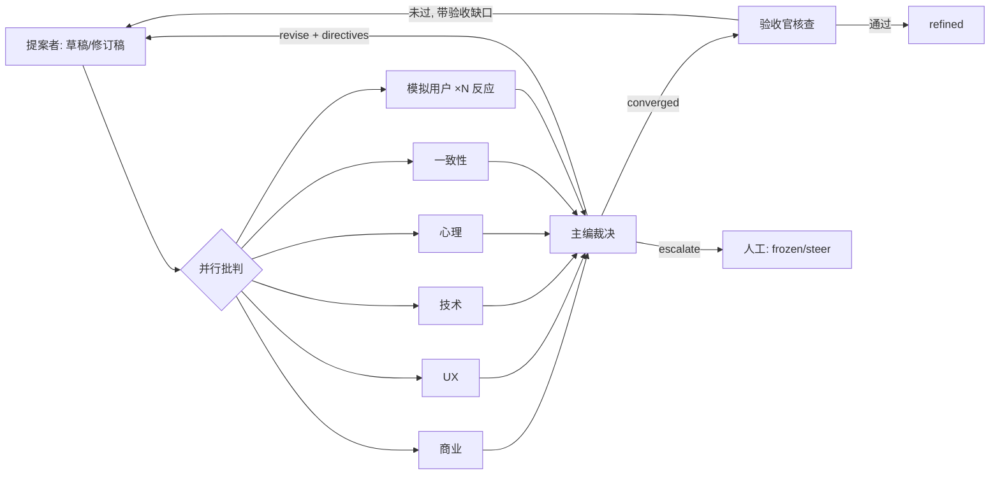

<!--
Project: my-ft
Created Date: 2026-06-12
Author: liming
Email: lmlala@aliyun.com
Copyright (c) 2025 FiuAI
-->

# 02 — 角色系统与多轮迭代协议

> 回答你的核心需求：「不是单 task 调 LLM，而是多角度、多轮迭代，
> 有批判角色和模拟用户，最后按验收标准验收」。

## 1. 角色模型

角色 = **prompt 模板 + skill 集 + 工具白名单 + 模型位 + 产出 schema**。
角色没有代码，全部是 cast.yaml 配置——新增视角不改内核。

```yaml
# studio-pack/cast.yaml (节选)
roles:
  proposer:
    model: workhorse
    skills: [emergent-narrative, scope-control]
    tools: [read_artifact, search_workspace, glossary_lookup]
    output: revision            # 产出: 完整修订稿
  critic_business:
    model: workhorse
    skills: [steam-positioning, pricing-model, scope-control]
    tools: [read_artifact, metrics_query]
    rubric: business_v1         # 每个批判者绑定锚定量表
    output: critique            # 产出: issue 列表 + 分数
  critic_ux: {skills: [ia-heuristics, cognitive-load, onboarding], ...}
  critic_tech: {skills: [deterministic-sim, save-migration], tools: [+sim_run], ...}
  critic_psych: {skills: [sdt-motivation, flow, fairness-attribution], ...}
  critic_consistency:           # 对照 brief 原则/术语/卡片间冲突
    skills: []                  # 一致性靠工具证据不靠知识
    tools: [read_artifact, glossary_lookup, dependency_graph, search_workspace]
  sim_user:                     # 模拟用户: 按 brief.personas 实例化 N 份
    model: workhorse
    instantiate_from: brief.business.audience_personas
    output: reaction            # 产出: 主观反应, 不打专业分
  referee:                      # 主编: 裁决与收敛判定
    model: judge
    output: verdict
  inspector:                    # 验收官: 对照验收标准逐条核查
    model: workhorse
    tools: [read_artifact, schema_validate, sim_run, metrics_query]
    output: acceptance_report
```

### 角色产出 schema（全部强制 JSON）

```jsonc
// critique（批判者）
{ "scores": {"维度": 1-5}, 
  "issues": [{ "id": "I-121", "severity": "blocking|major|minor",
               "field": "如何设计", "claim": "荒诞预算无下限会饿死温情事件",
               "evidence": "引用工具结果/skill检查点/brief字段",   // 必填!
               "suggestion": "..." }],
  "praise": ["值得保留的点"] }                                  // 防止改掉优点

// reaction（模拟用户）
{ "persona": "fm_fatigued", "verdict": "care|confused|bored|annoyed",
  "first_impression": "...", "would_complain": "...", "would_share": "..." }

// verdict（主编）
{ "decision": "revise|converged|escalate",
  "directives": [{"issue_ref": "I-121", "action": "accept|reject|defer",
                  "instruction": "给提案者的具体修订指令"}],
  "convergence": {"blocking_open": 0, "score_delta": 0.4, "rationale": "..."} }
```

**evidence 必填是反水分的关键设计**：批判必须引用工具证据（指标值、
搜索结果、依赖卡原文）、skill 检查点编号或 brief 字段——无证据的
issue 被内核门禁直接丢弃。这是中档模型批判质量的主要保障，比换大
模型有效。

## 2. 默认班子（my-ft 包）

| 角色 | 视角 | 一句话职责 |
| --- | --- | --- |
| 提案者 | 设计师 | 起草与修订，对 directives 逐条回应 |
| 商业批判者 | 市场/范围 | 这个设计帮卖游戏吗？副业做得完吗？ |
| UX 批判者 | 可用性 | 玩家看得懂、找得到、不疲劳吗？ |
| 技术批判者 | 可行性 | 确定性/性能/存档兼容有坑吗？（可跑 sim 验证） |
| 心理学批判者 | 动机/伦理 | 动机回路成立吗？有黑模式吗？ |
| 一致性批判者 | 全局 | 与 G1-G10/术语表/其他单元冲突吗？ |
| 模拟用户 ×4 | 四画像 | 我（玩家）在乎吗？哪里没看懂？ |
| 主编 | 裁决 | 综合批判→修订指令；判收敛/升级 |
| 验收官 | 门卫 | 验收标准逐条核查（机器项跑工具，LLM 项打分） |

模拟用户与批判者的本质区别：批判者按量表找毛病（专业视角），
模拟用户**不懂设计**——它的 prompt 是画像人设+「你在商店页/游戏里
看到这个功能」的情境，产出是主观反应。两者互补：批判者抓质量缺陷，
模拟用户抓「专业上没毛病但没人在乎」的方向性错误。

## 3. 反同质化设计（同一模型演全班子的风险）

- 差异主要来自**输入而非演技**：每个角色看到的上下文不同（商业批判者
  拿到 brief.business + 市场 skill；技术批判者拿到依赖单元接口 +
  sim 运行结果）——视角差异被物化为信息差异；
- 量表差异：每个批判者的 rubric 维度与锚定样例不同；
- 周度多样性审计（auditor 模型位）：抽样轮次，检查各角色 issue 的
  重合率；重合率 > 50% 说明角色退化为复读，需修 rubric/上下文配方；
- 允许角色绑定不同供应商模型（路由表一行配置），预算允许时商业与
  心理学批判者用不同家族的模型，天然多样性。

## 4. 轮次协议（内层循环）



每轮的机械步骤（内核执行）：

1. 组装各角色上下文（01 §6 缓存策略；按角色裁剪，单角色 ≤ 12k token）；
2. 并行调用批判者与模拟用户（asyncio）；
3. 门禁过滤无证据 issue；合并去重（同 claim 聚合）；
4. 主编裁决：对每条 open issue 给出 accept/reject/defer + 理由；
   **必须逐条处置上一轮遗留 issue**（防收敛剧场，README §6）；
5. 提案者修订：prompt 中 directives 逐条编号，修订稿需自报
   「每条指令的落实位置」（内核 diff 校验自报真实性）；
6. 写 reviews/round-n.json、更新 front-matter、git commit。

## 5. 方向注入（steering）

你的「可以输入一些方向」需求：

- `studio steer DIR-04 "荒诞预算改为按队伍独立而非全局，理由：..."`
  → 写入 `directions/DIR-04.md`，**持久置顶**于该单元后续所有轮次的
  主编与提案者上下文，优先级高于任何批判者意见；
- 方向有三种作用域：单元级（上例）、模块级（影响整个文件的单元）、
  全局级（等效临时新增设计原则，慎用，需写入 decisions/ 存档）；
- 方向与批判冲突时主编必须服从方向并在 verdict 中标注
  `overridden_by_steering`——你能看到「如果不是我拍板，agent 们
  想怎么改」，这是校准自己判断的免费反馈。

## 6. 收敛、停机与升级

**收敛判定**（主编给结论，内核强制执行）：
`converged = (blocking issue = 0) AND (major issue ≤ 1 且已 defer 有理由)
AND (两轮总分提升 < 0.3)` —— 三条同时满足。

**停机保护**：
- 轮次上限：stake=high 5 轮 / normal 3 轮 / low 2 轮，到顶未收敛 →
  escalate（frozen + 晨检清单）；
- 振荡检测：本轮修订与 2 轮前文本相似度 > 85% → 立即 escalate
  （在来回改同一段）；
- 分数不升反降 ≥ 0.5 → 回滚到历史最高分版本再 escalate（保底不变差）。

**stake 分级路由**（成本核心开关）：

| stake | 班子 | 模拟用户 | 轮上限 | 适用 |
| --- | --- | --- | --- | --- |
| high | 全班子 | 4 画像全员 | 5 | P0 卡、新系统、争议单元 |
| normal | 3 批判者（按单元类型路由）| 2 画像 | 3 | 多数单元 |
| low | 一致性批判者 + 验收官 | 0 | 2 | 文案级、P2 单元 |

估算（normal 档）：每轮 ≈ 5 次调用 × 10k token ≈ 50k token/轮，
3 轮 ≈ 150k token/单元 ≈ 中档模型几毛钱——多角色多轮在 workhorse
档完全负担得起；high 档约 ×3。

## 7. 验收（出口闸门）

- 验收官把单元的「验收标准」逐条分类执行：
  [机器] 项 → 调用对应工具（schema_validate / sim_run / metrics_query），
  附原始结果；
  [LLM] 项 → 按量表打分附理由；
  无法执行的条目 → 标注 `unverifiable` 并生成 issue（验收标准本身
  不合格，回炉——这会倒逼全库验收标准越写越可执行）；
- 验收报告存档进 reviews/，`refined` 状态的单元永远带着它的验收
  报告——后续人工 review 看报告不重查；
- 与 15-mentor 漏斗的关系：单元级验收用单元声明的钩子；批级/世界线级
  验收走漏斗——两层验收，互不替代。

## 8. 本文件实现验收标准

- [机器] cast.yaml 增删角色不改内核代码；角色产出 JSON schema 校验
  ≥ 98% 通过；
- [机器] 无证据 issue 拦截率 100%（构造测试）；上一轮 issue 未逐条
  处置时主编产出被拒绝重试；
- [机器] 三类停机保护各有单测（轮次上限/振荡/分数回退）；
- [人工] M1 验收：同批 10 个单元，多轮多角色版 vs M0 单轮版盲评，
  前者优 ≥ 7 例；
- [人工] steering 注入后下一轮立即生效且可在 verdict 中看到引用。
