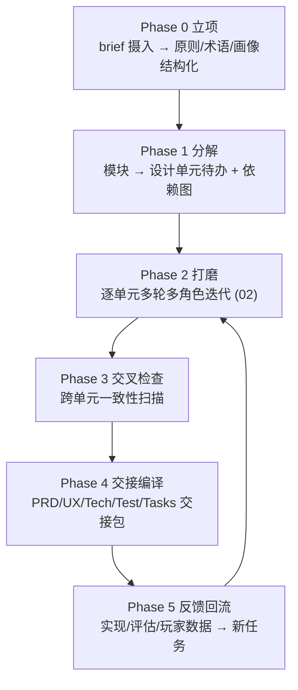

<!--
Project: my-ft
Created Date: 2026-06-12
Author: liming
Email: lmlala@aliyun.com
Copyright (c) 2025 FiuAI
-->

# 03 — 端到端管线与交接包

> 从「商业目标 + 风格 + 理念 + 系统模块」到「Claude Code / Cursor
> 可直接执行的实现文档」的完整旅程。

## 1. 六阶段管线（外层循环）



阶段不是瀑布：P2↔P3↔P5 长期循环；P4 按模块就绪逐个触发（不等全局）。

## 2. Phase 0 立项

- 输入：你手写的 brief.yaml 初稿（哪怕粗糙）；
- agent 工作：补全结构化（散文理念 → 编号原则；目标用户描述 →
  persona 卡）、生成术语表草案、标记 brief 内部矛盾（如「买断单机」
  vs「服务端强依赖」）请你裁决；
- 出口闸门：**brief 由你逐字段签收**（`decisions/brief-signoff.md`）。
  brief 是后续一切角色的宪法，宪法不能是 agent 写的。

## 3. Phase 1 分解

- 输入：brief.modules + （存量项目）现有设计文档；
- agent 工作：每模块拆设计单元清单（按 schema.yaml 的 unit 类型），
  生成 front-matter（优先级/stake/依赖图初稿），存量文档（如 my-ft
  的 88 张卡）做映射而非重写；
- 防过度分解：单元数预算（每模块 ≤ 12，超出需合并或升级为子模块，
  报你裁决）；
- 出口闸门：依赖图无环 + 你对 P0/high-stake 单元清单签收。

## 4. Phase 2 打磨

即 02 的轮次协议。补充两个管线级机制：

- **批处理节拍**：夜批（max-units 限额）+ 晨检（frozen 清单、
  escalate 裁决、steering 注入）——沿用 14 号 AGT-06 的 24 小时循环；
- **新鲜上下文纪律**：每轮从文件重新组装上下文（无会话累积），
  单元间不共享对话——隔离失败影响面。

## 5. Phase 3 交叉检查（多数框架缺的一层）

单元各自收敛 ≠ 全局自洽。周期性（每周/每 20 个 refined 单元）全库扫描：

- **机器扫描**（零 LLM）：术语漂移、悬挂引用、依赖图新环、同义重复
  单元（n-gram/向量相似）、接口字段对账（A 单元产出的字段 B 单元
  是否消费——my-ft 例：事件 schema 字段 vs 渲染模板槽位）；
- **LLM 扫描**（一致性批判者跑全局模式）：成对抽查强耦合单元
  （依赖边两端），找语义冲突（如 DIR-04 荒诞预算节奏 与 DIR-02
  压力曲线的隐含冲突）；
- 产出：冲突 issue → 任务队列 → 回到 Phase 2（涉事单元降回
  in_review）。

## 6. Phase 4 交接编译（核心交付物）

### 6.1 交接包结构

```text
studio-work/handoff/<module>@<version>/
├── 00-overview.md          # 模块一页纸: 目标/边界/与其他模块的契约
├── prd.md                  # 产品需求: 功能清单+用户价值+优先级+非目标
├── ux.md                   # UX 规格: 流程图+界面信息架构+交互契约+文案键
├── tech.md                 # 技术规格: 数据模型+接口+算法要点+非功能需求
├── tests.md                # 测试计划: 验收标准 → 可执行测试用例
├── tasks/                  # 有序实现任务 (编码 agent 的直接输入)
│   ├── T-001.md
│   └── ...
└── manifest.yaml           # 溯源: 来自哪些单元@revision, 签收状态
```

编译不是格式转换是**重组**：设计单元按「目的/理念/设计/验收」组织
（面向思考），交接包按「PRD/UX/Tech/Test」组织（面向实现）——
编译器（LLM 按模板 + 内核做溯源校验）把 N 个单元的内容重组进四份
文档，每段落带 `<!-- src: DIR-04@r7 -->` 溯源注释（实现期发现设计
问题能秒回源头单元）。

### 6.2 测试用例的生成规则

tests.md 是验收标准的下游加工：

- 单元验收里的 [机器] 项 → Given/When/Then 格式测试用例 + 建议的
  测试层级（单测/集成/跑批回归）+ 关联 15-mentor 规则 id（若有）；
- [LLM] 项 → 标记为「评估管线用例」，链接 EVAL-03 量表，不混入
  代码测试；
- 不可测条目在 Phase 2 已被验收官拦截（02 §7），到这里理论上为零
  ——若仍出现，编译器拒绝出包。

### 6.3 任务文件格式（Claude Code / Cursor 的直接输入）

```markdown
---
id: T-003
module: narrative-director
depends_on: [T-001]
size: M                # S/M/L, L 必须先拆
files_hint: [rust/src/sim/director/absurdity.rs, rust/config/director.ron]
acceptance_refs: [tests.md#absurdity-budget-1, tests.md#absurdity-budget-2]
---
## 目标
实现荒诞预算账本: 周回充/事件扣费/连发抑制 (来源: DIR-04@r7)
## 契约
输入: EventCandidate{absurdity, anchor_refs}; 输出: 过滤后候选 + LedgerLog
## 实现要点
- 预算上限 4.0, 回充 +1.0/周, 1级扣0.5, 2级扣2.0 (config 外置)
- 确定性: 使用 director 域 RNG 流 (SEED-01)
## 验收
- cargo test absurdity_budget_*  全绿
- 跑批 absurdity 分布在 WV-05 目标带 (运行 adapters/sim_run --check absurdity)
## 边界外 (明确不做)
- 风格倍率 (T-004); UI 展示 (T-009)
```

配套生成目标仓的 `AGENTS.md` 增量（告诉编码 agent：交接包在哪、
任务顺序、禁改区）。**编码 agent 消费的是 tasks/，人审查的是
prd/ux/tech**——两类读者两种文档，同源不同形。

### 6.4 出包闸门

- 模块全部关联单元 ≥ refined 且交叉检查无 open 冲突；
- 溯源校验：交接包每个需求都能溯到单元，每个单元的「如何设计」
  要点都被覆盖或显式标注 deferred（防编译丢内容）；
- 你签收 manifest（最后一道人闸：交接包出门=可以花实现成本了）。

## 7. Phase 5 反馈回流

三路输入统一变成任务卡（tasks/ 队列，EVAL-05 同构）：

- **实现反馈**：编码 agent/你在实现中发现设计缺陷 → issue 注明
  来源任务 T-xxx → 溯源回单元 → 单元降回 in_review，交接包标记
  过期段落；
- **评估反馈**：15-mentor 漏斗与 EVAL 报告的弱项（已有机制）；
- **真人反馈**：内测/社区反馈人工录入（带画像标签，喂给对应
  模拟用户角色做人设校准——模拟用户随真实数据进化，这是模拟
  用户长期不跑偏的锚）。

## 8. 本文件实现验收标准

- [机器] 六阶段状态持久化于工作区，任意阶段中断可恢复；
- [机器] 交接编译的溯源校验有单测（构造缺溯源/丢要点用例必拦）；
- [机器] 任务文件 front-matter schema 校验；依赖图无环；
- [人工] M3 验收（README §5）：一个真实模块交接包喂 Cursor/Claude
  Code，无需口头补充说明即可开工——「文档自足性」是交接包的
  终极测试；
- [人工] Phase 3 首次全库扫描产出的冲突数记录为基线，此后逐月下降。
