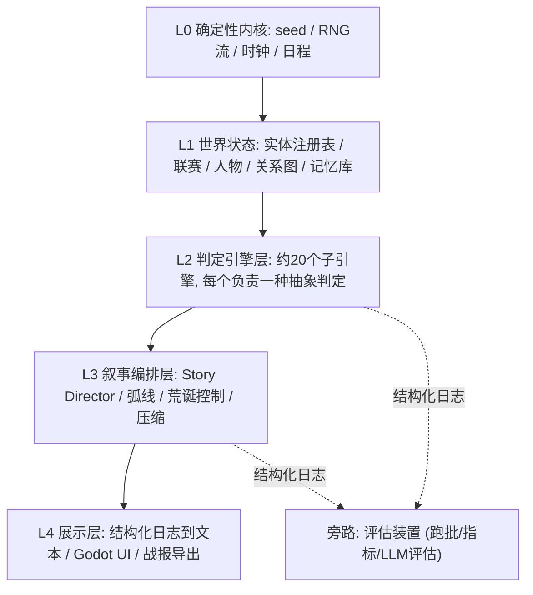

<!--
Project: my-ft
Created Date: 2026-06-12
Author: liming
Email: lmlala@aliyun.com
Copyright (c) 2025 FiuAI
-->

# ENG — 游戏引擎总体设计

> 卡片协议见 [`00-design-card-spec.md`](00-design-card-spec.md)。
> 本文件回答：整个模拟由哪几层组成、引擎之间如何通信、tick 如何推进。

## 分层总览



### ENG-01 五层架构与边界

状态: draft · 优先级: P0 · 依赖: 无

**目的**：给约 20 个引擎一个不会随功能膨胀而腐烂的骨架，明确"谁能改什么"，
避免子引擎互相直接改状态导致不可解释、不可测试。

**设计理念**：G4、G5、G9。涌现来自简单规则的交叉，而不是模块间的隐蔽耦合；
层间只允许单向依赖（高层读低层，低层不知道高层存在）。

**如何设计**：
- L0 确定性内核：主 seed、命名 RNG 流（SEED-01）、世界时钟、日程表；无业务逻辑；
- L1 世界状态：唯一可变状态容器；所有写入必须通过「带 cause_id 的状态补丁
  （StatePatch）」提交，禁止引擎直接持有 `&mut World`；
- L2 判定引擎：每个引擎实现统一 trait（ENG-03），只读世界视图 + 专属 RNG 流，
  输出判定结果 / 事件候选 / 状态补丁请求；引擎之间**不互相调用**，只通过
  L1 状态和事件总线间接耦合；
- L3 叙事编排：Story Director 消费候选、产出已选事件；弧线引擎与压缩引擎
  消费日志、产出叙事元数据；L3 不产生新事实，只选择与组织事实（DIR-01）；
- L4 展示：纯只读。文本渲染（EVT-06）、Godot UI、战报导出（UX-05）；
- 评估旁路：独立进程消费结构化日志，绝不写回世界状态（EVAL-01）。

**验收标准**：
- [机器] 依赖检查：L2 引擎模块之间无 `use` 互相引用（CI 脚本检查 mod 依赖）；
- [机器] 所有 L1 状态变更都带 cause_id，缺失即 panic（debug 模式）；
- [机器] L4 与评估旁路代码删除后，`cargo test` 模拟核心测试全部通过；
- [人工] 新增一个子引擎只需：实现 trait + 注册到管线 + 写卡片，不改其他引擎。

**评估钩子**：
- 日志字段 `source_engine` 覆盖率 = 100%；
- 回归基线：同 seed 下逐 tick 状态哈希一致（G5）。

### ENG-02 Tick 管线与阶段顺序

状态: draft · 优先级: P0 · 依赖: ENG-01

**目的**：固定每个模拟日的执行顺序，使任何两次运行的引擎调度完全一致，
且每个阶段的产物对后续阶段可见性明确。

**设计理念**：G5。顺序即语义：训练影响当天社交，社交影响当晚比赛，比赛
影响赛后事件——顺序错了故事因果就错了。

**如何设计**：
- 单日 tick 固定 11 阶段（继承 `docs/05-engine-architecture.md`）：
  1 校验玩家命令 → 2 日程/日期 → 3 训练/恢复/状态 → 4 社交互动 →
  5 关系/派系更新 → 6 比赛日比赛 → 7 事件候选生成 → 8 Director 选牌 →
  9 应用效果 → 10 写记忆与日志 → 11 快照/存档点；
- 每阶段声明：读哪些状态域、写哪些状态域（写通过 StatePatch 队列，阶段末
  统一按确定顺序应用）；
- 同一阶段内多引擎按**注册顺序**串行执行；禁止阶段内并行（副业项目，
  确定性优先于性能，G8）；
- 周/月/赛季级钩子挂在对应日的阶段 2（如转会窗开启、赛季结算）；
- 玩家命令只在阶段 1 消费：UI 在任何时刻提交命令进队列，下一 tick 生效。

**验收标准**：
- [机器] 阶段越权写入（在未声明的状态域提交补丁）触发 debug 断言；
- [机器] 同 seed 连跑 3 次，全部 tick 的阶段日志序列逐字节一致；
- [机器] 暂停/存档/读档发生在任意 tick 边界，续跑结果与不中断一致；
- [人工] 任意一个事件能从日志还原它在哪个 tick 哪个阶段产生。

**评估钩子**：
- 跑批统计各阶段产出的事件候选数分布，监控某阶段长期为零（设计死区）。

### ENG-03 引擎统一接口契约

状态: draft · 优先级: P0 · 依赖: ENG-01, ENG-02

**目的**：让"新增一种判定"成为低成本操作，并让设计 agent 能按同一模板
为每个引擎写卡片、评估管线能按同一方式注入探针。

**设计理念**：G10。每个引擎 = 一种抽象判定（一个问题），如"今天谁的情绪
变了、为什么"。接口统一后，引擎数量增长不增加架构复杂度。

**如何设计**：
- Rust trait 草案：

```rust
pub trait JudgmentEngine {
    fn id(&self) -> EngineId;                 // 与卡片 ID 对应
    fn phase(&self) -> TickPhase;             // 挂载阶段
    fn run(&self, view: &WorldView, rng: &mut RngStream, out: &mut EngineOutput);
}
// EngineOutput 仅三种产物:
//   patches: Vec<StatePatch>      带 cause_id 的状态变更请求
//   candidates: Vec<EventCandidate> 事件候选(仅阶段7引擎可产)
//   logs: Vec<LogRecord>          结构化日志
```

- `WorldView` 是只读快照视图；`RngStream` 由引擎 ID 派生（SEED-01），
  保证增删引擎不扰动其他引擎的随机序列；
- 每个引擎必须有：卡片（04-engine-catalog 或专属文件）、独立单测、
  至少 1 个评估钩子指标；
- 引擎配置（权重、阈值、曲线）全部外置为数据文件（RON/JSON），热调参
  不改代码——这是后续 agent/评估自动调参的接口。

**验收标准**：
- [机器] 所有引擎通过同一注册表接入，`EngineId` 与卡片 ID 一一对应；
- [机器] 删除任意单个引擎，编译通过且其余测试不挂（输出变化但不崩溃）；
- [机器] 引擎配置文件 schema 校验通过；改配置不需要重新编译；
- [人工] 设计 agent 能仅凭本卡片 + 目标卡片为新引擎生成完整设计而无需读代码。

**评估钩子**：
- 每引擎产出量统计（patches/candidates/logs 每百 tick），偏离历史基线告警。

### ENG-04 因果链与结构化日志

状态: draft · 优先级: P0 · 依赖: ENG-01

**目的**：实现 G4 的物理基础。日志不是调试工具，是产品本体——战报、
事件回溯 UI、LLM 评估全部从这里读。

**设计理念**：G3、G4。自然语言是渲染结果；真值是带因果链的结构化记录。
如果日志不能解释，玩家就会觉得"被骰子惩罚"（PSY-05）。

**如何设计**：
- LogRecord 必含字段：`schema_version, tick, date, source_engine, actor_ids,
  club_ids, match_id?, cause_ids[], before, after, delta, tags[], severity,
  absurdity, message_key`（展示文本由 message_key + 参数渲染，EVT-06）；
- cause_ids 形成 DAG：任何记录可向上追溯到根因（比赛时刻/玩家命令/
  Director 发牌/世界生成）；
- severity 分 5 级（trace/minor/notable/major/season-defining），UI 与战报
  按级别过滤；absurdity 0-3（DIR-04）；
- 日志按赛季分文件归档（沿用 `saves/` 约定），提供按 actor / club / tag /
  cause 链查询的索引；
- 写入预算：notable 以上每队每周 ≤ 12 条 [待评估校准]，防日志洪水。

**验收标准**：
- [机器] 随机抽 100 条 major 记录，cause_ids 全部可解析且无环；
- [机器] 单赛季日志文件 < 50MB；查询任意 actor 的全季记录 < 100ms；
- [机器] message_key 全部在文本模板表中存在（无孤儿键）；
- [LLM] 抽样事件链交给评估器，"能否仅凭日志重述这个故事"评分 ≥ 4/5（EVAL-03）。

**评估钩子**：
- 因果链平均深度、断链率（cause_id 指向不存在记录的比例，应为 0）；
- severity 分布形状（季节性起伏应与压力曲线 DIR-02 相关）。

### ENG-05 评估装置旁路

状态: draft · 优先级: P1 · 依赖: ENG-04

**目的**：把"跑批模拟 + 指标 + LLM 评估"作为一等公民固化在架构里，
而不是事后脚本。这是设计 agent 闭环（apps/design-studio）的输入端。

**设计理念**：G5、G8。一个人没有 QA 团队，评估装置就是 QA；它必须便宜
（无头、可并行、增量）且与游戏代码零耦合。

**如何设计**：
- CLI 入口：`sim_cli batch --seeds 1000..1100 --seasons 3 --out runs/`；
  每 seed 产出：日志归档 + 赛季战报 + 机械指标 JSON（EVAL-02）；
- 指标计算在 Rust 内完成（免费、快）；LLM 评估读取战报与抽样事件链
  （EVAL-03），独立 Python 进程；
- 基线管理：每次设计/调参变更后跑同一组 seed，与基线指标 diff，输出
  «变好/变坏/无影响» 报告；
- 评估结果回写为设计任务（EVAL-05），不回写世界状态。

**验收标准**：
- [机器] 100 seed × 1 赛季跑批在开发机 < 10 分钟（无 LLM 部分）；
- [机器] 跑批产物含可复现实验元数据：git commit、配置哈希、seed 区间；
- [机器] 基线 diff 报告能定位到引擎级（哪个引擎的指标movement最大）。

**评估钩子**：
- 本卡片即评估装置自身；其健康指标为跑批失败率 = 0、产物 schema 稳定。

### ENG-06 规模与性能预算

状态: draft · 优先级: P2 · 依赖: ENG-02

**目的**：提前锁定世界规模上限，防止设计卡片各自膨胀导致组合爆炸。

**设计理念**：G8。窄而深：10 队联赛的深度社会模拟，胜过 100 队的浅表。

**如何设计**：
- MVP 规模：1 国家 / 1 联赛 / 8-12 队 / 每队 18-22 人 / 总 Actor ≤ 350
  （含老板、记者、经纪人、家属）；
- 关系图边数预算：每 Actor 活跃边 ≤ 30，全图 ≤ 10k 边（REL-01）；
- 记忆预算：每 Actor 活跃记忆 ≤ 40，归档记忆不限但只可被检索（ACT-03）；
- 性能目标：单 tick < 5ms（开发机），整赛季无头模拟 < 5s；
- 任何卡片要求扩大上述预算，必须先改本卡片并说明对 G8 的影响。

**验收标准**：
- [机器] 跑批中实体数、边数、记忆数从不超过预算（超限 = 测试失败）；
- [机器] 整赛季无头模拟耗时纳入 CI 基准，劣化 >30% 告警。

**评估钩子**：
- 跑批输出内存峰值与 tick 耗时分布。
