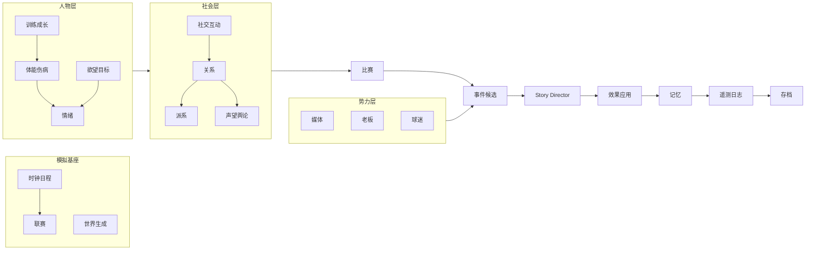

<!--
Project: my-ft
Created Date: 2026-06-12
Author: liming
Email: lmlala@aliyun.com
Copyright (c) 2025 FiuAI
-->

# CAT — 子引擎 / 子子引擎总目录

> 每个引擎负责**一种抽象判定**（ENG-03）。本文件给出全景目录与依赖图；
> 有专属文件的引擎只列条目，无专属文件的引擎在本文件持有卡片。

## 引擎全景（22 个）

| # | 引擎 | 抽象（它回答的唯一问题） | 阶段 | 卡片 |
| --- | --- | --- | --- | --- |
| 1 | 时钟日程 | 今天是哪天，有什么日程 | 2 | ENG-02 |
| 2 | 世界生成 | 新世界长什么样 | 新档 | SEED-02 |
| 3 | 联赛 | 积分榜与赛程如何更新 | 2/6 | WV-02 |
| 4 | 训练成长 | 谁的能力变了 | 3 | CAT-01 |
| 5 | 体能伤病 | 谁的身体状态变了 | 3 | CAT-02 |
| 6 | 情绪 | 谁的心情变了 | 3 | ACT-02 |
| 7 | 人格判定 | 此人此情境会怎么做 | 各处 | ACT-01/05 |
| 8 | 记忆 | 谁记住/忘记/想起了什么 | 10 | ACT-03 |
| 9 | 欲望目标 | 谁想要什么、满足了吗 | 3 | ACT-04 |
| 10 | 社交互动 | 今天谁和谁发生了互动 | 4 | REL-02 |
| 11 | 关系 | 二元关系如何变化 | 5 | REL-01 |
| 12 | 派系 | 团体如何聚散 | 5 | REL-03 |
| 13 | 声望舆论 | 大家怎么看某人/某队 | 5 | REL-04 |
| 14 | 媒体 | 记者写了什么标题 | 7 | CAT-03 |
| 15 | 老板 | 老板满意吗、要干预吗 | 7 | CAT-04 |
| 16 | 球迷 | 看台情绪与组织行动 | 7 | CAT-05 |
| 17 | 比赛 | 这场球发生了什么 | 6 | MAT-* |
| 18 | 事件候选 | 此刻可能发生什么 | 7 | EVT-02 |
| 19 | Story Director | 让什么真的发生 | 8 | DIR-* |
| 20 | 效果应用 | 事件如何改变世界 | 9 | EVT-03 |
| 21 | 遥测日志 | 如何记录真值 | 10 | ENG-04 |
| 22 | 存档 | 如何冻结与恢复世界 | 11 | CAT-06 |

依赖原则：表中靠下的引擎可读靠上引擎写入的状态，反向禁止（ENG-01）。

### CAT-01 训练成长引擎

状态: draft · 优先级: P1 · 依赖: ENG-03, ACT-01

**目的**：回答「谁的能力变了、为什么」。训练是玩家最高频的可控输入
（G1），必须产生可感知且可解释的差异。

**设计理念**：训练不只是涨数值，是社交与叙事现场：偷懒、加练、冲突、
师徒——把成长做成事件源而不是后台公式。

**如何设计**：
- 玩家设置：周训练重点（进攻/防守/体能/定位球）、强度（3 档）、
  单人关注名单（≤ 3 人）；
- 成长公式：Δ技能 = 训练匹配度 × 年龄曲线（ACT-06）× 职业心特质 ×
  状态系数 × 随机项（专属 RNG 流）；
- 判定输出（事件候选源）：偷懒（低职业心+低被关注）、加练（高野心+
  替补身份）、训练冲突（关系恶劣对 + 高强度）、惊艳表现（天赋+被关注）
  ——每周训练产生 0-2 个候选 [待评估校准]；
- 强度代价：高强度提升成长与伤病风险（CAT-02 读取），叠加抱怨候选；
- 单人关注是承诺机制：被关注者期望值上升，撤销关注产生失落记忆（ACT-03）。

**验收标准**：
- [机器] 同 seed 下不同训练设置产生可测差异：赛季末队均技能差 ≥ 2 点；
- [机器] 训练事件候选触发率落在每周每队 0-2 区间；
- [LLM] 抽训练冲突事件链评因果可读性 ≥ 4/5。

**评估钩子**：
- 成长分布按年龄/特质分组的合理性；训练类事件占比。

### CAT-02 体能伤病引擎

状态: draft · 优先级: P1 · 依赖: ENG-03, CAT-01

**目的**：回答「谁的身体出问题了」。伤病是体育叙事最强的天然事件源，
也是「带伤上场」这类道德困境（MVP 成功句式之一）的机制基础。

**设计理念**：伤病必须可归因（疲劳积累/高强度/比赛犯规/旧伤），让玩家
事后能复盘「是我把他用废的」——后果感来自因果（G4）。

**如何设计**：
- 状态量：体能（0-100，比赛-20~-35、训练-5~-15、休息+10~+20）、
  疲劳积累（连续高负荷的隐性计数）、旧伤标记；
- 伤病判定：P(伤) = 基础率 × 疲劳系数 × 强度系数 × 年龄系数 × 旧伤系数
  × 比赛对抗系数；伤病分 4 级（1-3 日 / 1-3 周 / 1-3 月 / 赛季报销）；
- 带伤出场机制：医疗组给出风险评估（含不确定性，G1），玩家可强行派遣，
  加重概率 ×3 [待评估校准]，同时写入球员「被牺牲/被信任」双向记忆分支
  （取决于结果与球员特质——同一决策不同人格不同解读，ACT-01）；
- 伤病的社会涟漪：替补上位（机会事件）、更衣室物伤其类（情绪）、
  媒体追问责任（CAT-03 候选）。

**验收标准**：
- [机器] 跑批赛季伤病率落在现实带：每队每季重伤 1-3 人次、轻伤 8-20
  人次 [待评估校准]；
- [机器] 每个伤病记录的 cause_ids 含归因链（疲劳/犯规/强行出场）；
- [LLM] 「带伤上场→报销→更衣室反应」链条的戏剧评分 ≥ 4/5。

**评估钩子**：
- 伤病归因分布；带伤出场决策的后续记忆引用率。

### CAT-03 媒体引擎

状态: draft · 优先级: P1 · 依赖: ENG-03, WV-04, REL-04

**目的**：回答「记者把这事写成了什么」。媒体是把模拟事实扭曲成舆论
压力的转换器，也是黑色幽默的主要输出口。

**设计理念**：记者不是世界的旁白，是有偏见、有内线、有流量焦虑的
Actor。同一事实经不同记者产出不同标题——扭曲量是性格的函数（G6）。

**如何设计**：
- 每个记者：偏见表（亲/黑哪些俱乐部与人物）、内线（1-2 个更衣室
  消息源 Actor）、风格（标题党/数据控/阴谋论/人情味）、流量压力值；
- 选题判定：扫描近 7 日 notable 日志，按（事实戏剧值 × 偏见匹配 ×
  流量饥渴）选 1-2 条加工成媒体事件候选；
- 扭曲机制：每条报道带「事实偏离度」0-2（0 如实/1 夸张/2 歪曲），
  偏离度由记者风格与内线质量决定；歪曲报道可被当事人记忆并结怨
  （记者 Actor 可以成为宿敌——媒体线的长期戏）；
- 报道效果：改变球迷情绪、老板压力、当事人心情；连续聚焦同一对象
  形成「媒体叙事」标签（捧杀/猎巫），影响后续事件权重；
- 玩家接口：赛前赛后发布会 3 选 1 口径（UX-02），口径被扭曲的概率
  取决于在场记者构成——玩家学会「对什么人说什么话」。

**验收标准**：
- [机器] 每条媒体事件可回溯到源事实日志（cause_id），偏离度字段完备；
- [机器] 每记者赛季报道量 8-20 条 [待评估校准]，偏见对象覆盖其偏见表；
- [LLM] 抽 10 条歪曲报道，「扭曲方式符合该记者人设」≥ 4/5。

**评估钩子**：
- 偏离度分布；媒体叙事标签（捧杀/猎巫）形成率与后续引用率。

### CAT-04 老板引擎

状态: draft · 优先级: P1 · 依赖: ENG-03, WV-04

**目的**：回答「老板满意吗、这次要干预什么」。老板是玩家头顶的不可控
压力源，下课机制的执剑人（G1）。

**设计理念**：老板模板化性格 + 满意度账本 + 干预剧目表。荒唐 KPI 是
合法荒诞源（吉祥物迷信型，absurdity=2 带性格锚点）。

**如何设计**：
- 满意度账本：成绩项（目标差值）、面子项（媒体形象、对豪门战绩）、
  钱包项（财政、票房）、私人项（玩家是否顺从历史）；各项权重由老板
  模板决定（WV-04 五型）；
- 干预剧目表（按满意度区间解锁）：口头嘉奖/施压声明/塞人首发「建议」/
  强制卖人/荒唐 KPI/最后通牒/解雇；每型老板剧目概率不同；
- 玩家应对接口：服从/拖延/公开顶撞，各有满意度与更衣室声望的反向
  代价（顺老板可能失更衣室，G1 的两难设计）；
- 解雇判定：满意度 + 连败 + 球迷压力的复合阈值，触发前必有 ≥ 2 次
  可识别预警事件（公平感，PSY-05）。

**验收标准**：
- [机器] 跑批中解雇前 100% 存在预警事件链；荒唐 KPI 仅由对应模板产生；
- [机器] 干预频率每季每队 1-4 次 [待评估校准]；
- [LLM] 「老板行为符合其模板人设」≥ 4/5。

**评估钩子**：
- 各模板干预剧目分布；玩家应对选择与后续满意度轨迹的相关性。

### CAT-05 球迷引擎

状态: draft · 优先级: P2 · 依赖: ENG-03, WV-04, REL-04

**目的**：回答「看台什么情绪、球迷组织要干什么」。球迷是身份认同的
化身，给胜负附加社会重量。

**设计理念**：球迷组织是慢变量情绪容器：日常只输出氛围值（主场加成、
嘘声），积怨到阈值才有组织行动（横幅、抗议、分裂）——低频高冲击。

**如何设计**：
- 每队球迷总情绪（快变量，跟战绩与事件）+ 1-2 个球迷组织（WV-04
  五派之一，慢变量立场账本：对教练/老板/个别球员的态度）；
- 组织行动表：助威 TIFO / 嘘特定球员 / 反老板横幅 / 围堵训练场 /
  组织分裂（荒诞锚点示例：门将胡子审美分歧，absurdity=2）；
- 行动影响：主场比赛士气修正（MAT-03）、被嘘球员心情、老板面子项
  （CAT-04 读取）；
- 文化标签调制：青训圣地卖青训核心，球迷怒气 ×2（WV-03 连接点）。

**验收标准**：
- [机器] 组织行动每季每队 1-3 次 [待评估校准]；每次行动可回溯立场账本；
- [LLM] 「球迷行动是否像该俱乐部文化会做的事」≥ 4/5。

**评估钩子**：
- 球迷情绪曲线与战绩的滞后相关；组织行动类型分布。

### CAT-06 存档引擎

状态: draft · 优先级: P0 · 依赖: ENG-04, SEED-01

**目的**：回答「如何无损冻结与恢复世界」。存档完整性是确定性承诺
（G5）的另一半。

**设计理念**：存档是世界的全量快照 + RNG 状态 + 日志游标；加载时校验
引用完整性后才返回可玩状态（继承现有架构约定）。

**如何设计**：
- 内容：schema 版本、主 seed 与全部 RNG 流状态、日期/tick/赛季、实体
  注册表、赛程赛果、Actor 全状态、关系图、派系、记忆库、弧线状态
  （DIR-06）、荒诞预算（DIR-04）、日志游标；
- 版本迁移：schema_version + 逐版本迁移函数链；不支持跳版本盲加载；
- 校验：加载时全引用解析（actor_id/cause_id/memory_id 无悬挂），失败
  拒绝加载并报告损坏项；
- 自动存档：每模拟周 + 每场比赛后；保留滚动 N=10 份。

**验收标准**：
- [机器] 存→读→续跑 100 tick 与不中断运行状态哈希一致（G5 核心测试）；
- [机器] 人为损坏存档字段，加载被拒绝且错误信息定位到字段；
- [机器] 10 赛季档存档体积 < 20MB、加载 < 2s。

**评估钩子**：
- 跑批随机插入存读档点的回归测试通过率 = 100%。
