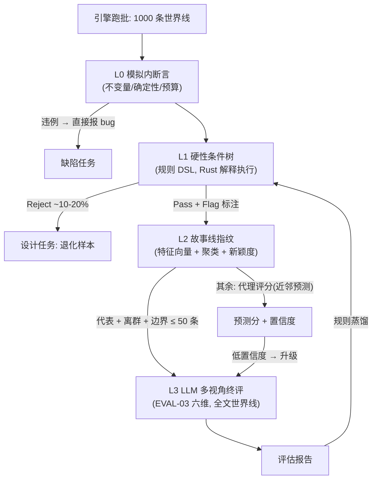

<!--
Project: my-ft
Created Date: 2026-06-12
Author: liming
Email: lmlala@aliyun.com
Copyright (c) 2025 FiuAI
-->

# MEN — Mentor 故事线漏斗（思路稿）

> **状态：思路稿（pre-draft）**。按约定本文先给完整思路供单独讨论，
> 讨论定稿后再按 00 协议拆卡。本文回答的问题：
> 引擎一晚生成 N 条世界线，LLM 不可能全读——Mentor 如何用**可设计的
> 硬性条件树**预先筛选，只把值得评的世界线送进 LLM 终评。

## 1. 问题定义与数量级

设一次夜批 = 1000 seed × 1-3 赛季。每条世界线的结构化日志数万条，
压缩成战报也有 2-4k token。若全部送 LLM 六维评估：

> 1000 条 × 3k token × 多视角 ≈ 千万级 token / 晚 —— 成本和时间都不可行。

目标：**LLM 只读 ≤ 5% 的世界线**（约 30-50 条），且这 5% 必须是
「最有信息量的样本」：代表性的、新颖的、可疑的。其余 95% 由零成本的
机械层给出结论或代理评分。

## 2. 四级漏斗架构



各层定位一句话：
- **L0**：跑批时引擎内 assert（已有 EVAL-02/SEED-03 的范畴），坏数据不出门；
- **L1**：你点名的「硬性条件，出现 xx 多少次」——声明式规则树，本文重点（§3）；
- **L2**：解决「规则都通过的世界线仍然太多且大量雷同」——指纹去重 + 新颖度选样（§4）；
- **L3**：LLM 只做它不可替代的事：对**完整世界线**做多视角品味评估（EVAL-03 不变）。

## 3. L1 硬性条件树：规则 DSL 草案

### 3.1 设计目标

1. **声明式、数据化**：规则是配置文件不是代码——你说的「这个树也能设计」：
   规则树本身是设计产物，有 ID、有版本、可被设计 agent 起草、可进卡片库管理；
2. **在结构化日志上可廉价求值**：Rust 单遍扫描 logs.jsonl，每条世界线毫秒级；
3. **表达力够用即可**：计数 + 布尔树 + 时序模式三类算子起步，不上完整时序逻辑
   （表达力升级是开放问题 §7-Q1）。

### 3.2 算子草案

```ron
Rule(
  id: "R-betrayal-echo",            // 规则也有 ID, 纳入卡片协议管理
  scope: Season,                    // 求值范围: Week / Season / WorldLine(跨赛季)
  expr: And([
    // —— 计数类: "出现 xx 多少次" ——
    Count(Tag("promise_broken"), Gte(1)),
    Count(Category(Faction), Between(1, 4)),
    Ratio(Absurdity(2), Lte(0.12)),          // 占比类
    // —— 时序类: 先后/窗口/因果 ——
    Seq([
      Match(Tag("promise")),                  // 先有承诺
      Within(days: 90, Match(Tag("promise_broken"))),  // 90日内被弃
      Within(days: 45, CauseRefPrev(Tag("faction_shift"))), // 且45日内有派系变动引用该事件
    ]),
    // —— 量词类: 对实体集合 ——
    ForSome(Actor(role: Player), CauseChainDepth(Gte(4))),
    // —— 指标类: 复用 EVAL-02 机械指标 ——
    Metric("tension_envelope_corr", Gte(0.5)),
  ]),
  verdict: Flag("有完整背叛回响线"),   // 三种结论: Pass / Flag(理由) / Reject(理由)
)
```

算子全集（第一版建议）：
`Count / Exists / Ratio / Between`（计数）；`And / Or / Not / AtLeast(k, [..])`
（布尔树）；`Seq / Within / After / CauseRefPrev / CauseChainDepth`（时序与
因果）；`ForSome / ForAll / ForCount`（实体量词）；`Metric`（EVAL-02 指标
直引）。

### 3.3 规则的三种用途（同一 DSL，不同 verdict 语义）

| 类型 | verdict | 用途 | 例 |
| --- | --- | --- | --- |
| 验收型 | Pass/Fail 统计 | 批级健康度：「20 seed 内必须出现过」 | 派系形成≥1、记忆引用≥15%、老板干预 1-4 次 |
| 否决型 | Reject | 退化世界线不送 LLM，直接生成设计任务 | 全季零派系、同事件刷屏>5 次、张力曲线平直 |
| 选样型 | Flag | 给 L2 提供「值得看」标注，提高入选权重 | 完整背叛线、三声望大错位、王朝崩塌 |

**第一版规则库的来源现成**：把 `docs` MVP 叙事验收清单（连胜压力/连败
危机/关键伤病/替补不满/老板干预/媒体误读/派系形成/关系破裂/修复/关键战
英雄罪人/记忆引用）逐条形式化成验收型规则，就是 R-001 到 R-011。

### 3.4 规则树的「可设计性」

- 每条规则 = 一个小设计件：`{id, 版本, 动机说明, 表达式, 预期通过率带}`，
  存 `football-docs/_rules/`（或 `rust/config/rules/`），与卡片库同 git 流程；
- 设计 agent（apps/design-studio）可以起草规则：从 LLM 终评报告的「最差时刻」模式
  反推否决型规则草案（§5 规则蒸馏），人工批准后入库；
- 每条规则带**预期通过率带**：跑批后实际通过率超带即告警——规则本身
  也被评估（规则烂大街或永不触发都是规则的 bug）；
- 规则树支持组合引用（规则引用规则），形成你说的「树」：叶子是算子，
  中间节点是具名规则，根是批级验收套件。

## 4. L2 故事线指纹：去重与新颖度选样

规则全过的世界线可能还有几百条，且大量「换了名字的同一个故事」。
L2 把每条世界线压成一个**指纹向量**（约 60-120 维，全部来自机械统计，
零 LLM）：

- 事件类别直方图、absurdity 分布、severity 分布；
- 弧线类型计数与收束方式分布（DIR-06）；
- 张力曲线形状系数（对曲线做 DCT/分段斜率取前 k 项——曲线形状即
  故事节奏的指纹）；
- 派系生命周期统计、关系图模块度轨迹（REL-03）；
- cause 链深度分布、记忆引用率（EVT-04）；
- 联赛格局特征（冠军悬念保持轮数、排名方差轨迹）。

选样策略（送 L3 的 ≤ 50 条怎么挑）：

1. **代表**：指纹聚类（确定性 k-means，k≈30-50），每簇取中心 1 条
   ——保证覆盖面；
2. **离群**：与「已评估世界线指纹库」最近邻距离最大的 top-N
   ——新颖的东西优先看（最可能藏着惊喜或新 bug）；
3. **边界**：规则求值中「踩线通过/踩线失败」的样本——规则阈值
   附近的世界线信息量最大；
4. **代理评分**：其余世界线用指纹库近邻的历史 LLM 分数做加权预测
   （KNN 起步，数据多了换 GBDT），带置信度；低置信度自动升级送 L3。

随评估积累，指纹库越来越大 → 代理评分越来越准 → LLM 调用率持续
下降。这是个标准的主动学习结构，正好是你的背景能亲手调好的部分。

## 5. 规则蒸馏：漏斗的自我增密

LLM 终评不只是打分，还产出「最差时刻引用」（EVAL-03 已定义）。
蒸馏循环：

> LLM 发现某类烂叙事（如「和解事件在冲突后 2 天内出现，廉价」）
> → agent/人将其转写为否决型或 Flag 规则（`Seq([conflict, Within(2d,
> reconcile)]) → Reject("廉价和解")`）
> → 下批起此类样本不再消耗 LLM 配额，直接进设计任务。

健康指标：**LLM 调用率逐版本下降，而人工抽检的「漏网烂叙事率」不升**
——漏斗在变密且没变瞎。反向保护：否决型规则每季度人工复审一次，
随机抽 Reject 样本人工看 5 条，防止把「有趣的怪东西」误杀（开放问题 Q4）。

## 6. 与现有卡片的关系（定稿后的拆卡预告）

- EVAL-03 的「抽样策略」节将被本漏斗替代（盲抽 → 漏斗选样）；
- EVAL-02 指标即 L1 `Metric` 算子与 L2 指纹的原料，无需改动；
- EVAL-05 任务回写新增两个来源：L1 Reject 样本、L2 高新颖度+低分样本；
- 预计拆出卡片：MEN-01 漏斗总架构 / MEN-02 规则 DSL 与求值器 /
  MEN-03 规则库治理 / MEN-04 指纹与选样 / MEN-05 代理评分 /
  MEN-06 规则蒸馏闭环。

## 7. 留给讨论的开放问题

- **Q1 DSL 表达力边界**：Count+布尔树+Seq/Within 是否够？要不要实体
  绑定变量（「同一个 actor 贯穿三个事件」——目前 CauseRefPrev 只能
  沿因果链绑定，不能自由 join）？我的倾向：第一版不做自由 join，
  靠 cause 链绑定够用，复杂模式宁可拆成两条规则；
- **Q2 指纹维度的选择与漂移**：游戏机制迭代后指纹分布漂移，历史
  指纹库要不要按版本分层/重算？我的倾向：按「打破世界线的版本」
  （SEED-03 政策）分代，跨代只做参考不做代理评分；
- **Q3 漏斗目标数字**：1000 → L1 后 ~700-850 → L2 选样 ≤ 50 送 LLM，
  这组数字的合理性需要第一个月实跑校准；
- **Q4 否决规则的误杀治理**：谁有权加否决规则（建议：agent 只能提案
  Flag 规则，否决型必须人工批准）；误杀审计的抽样率；
- **Q5 多赛季世界线的评估单位**：按赛季切片评还是整条世界线评？
  我的倾向：L1/L2 按赛季，L3 给 LLM 的是「整条世界线的分章战报」
  （DIR-05 的格局演化只有跨季才能评）；
- **Q6 规则与卡片的双向引用**：规则 id 是否进卡片的「评估钩子」字段
  成为第一公民（我的倾向：是，钩子从「指标描述」升级为「指标 +
  规则 id 列表」）。
