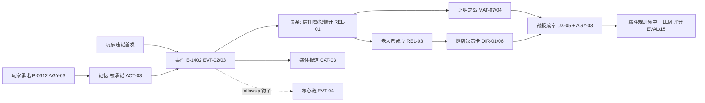

<!--
Project: my-ft
Created Date: 2026-06-12
Author: liming
Email: lmlala@aliyun.com
Copyright (c) 2025 FiuAI
-->

# 黄金样例：替补门将的怨恨（纵切 worked example）

> **用途**：团队对齐文档。把一条完整故事线从世界生成到战报逐步走通，
> 每一步标注负责系统的卡片 ID 与具体数值——产品看体验是否成立、
> 策划看系统咬合是否正确、开发看数据流与接口、QA 看每步的可验证断言。
> **纪律**：本文是样例不是卡片；与卡片冲突时以卡片为准并修订本文。
> 数值取各卡初始值（黄色参数，NUM-06），仅为展示量级。

## 出场人物（seed 8742 的生成结果，SEED-02）

| 人物 | 关键属性 | 初始状态 |
| --- | --- | --- |
| 卡列夫（替补门将，29 岁） | 忠诚 72 / 自尊心 81 / 特质·记仇 | 出场欲望强度高；对玩家信任 55 |
| 主力门将布兰 | 能力略高于卡列夫（门线 71 vs 66） | 状态起伏大（情绪稳定 38） |
| 队长奥萨（34 岁老将） | 更衣室领袖特质；更衣室声望 88 | 老人帮潜在核心（REL-03 初始簇） |
| 玩家主教练 | — | 三声望均 50（REL-04） |

世界生成时的**戏剧种子注入**（SEED-02 第 5 步）已埋下不稳定因素：
"双门将能力接近 + 替补高自尊"，出厂报告标注为该队 3 个火药桶之一。

## 逐周走线

### 第 6 周：承诺（玩家动词 → 记忆写入）

玩家在人事窗口（UX-02 周三锚点）对卡列夫使用**承诺**动词（AGY-02
表：大杠杆/赛季兑现/违诺即背叛）：「杯赛首发是你的」。

- 命令经 tick 阶段 1 校验（ENG-02），生成 `player_decision` 节点
  P-0612（AGY-03），附信息快照：当时布兰状态"低迷"档；
- 效果应用（EVT-03）：卡列夫 对玩家信任 55→+12→67（类内加法，
  NUM-02），出场欲望满足度预期上调（ACT-04 账本记入待兑现承诺）；
- 记忆写入（ACT-03）：类型=被承诺，极性 +45，显著度 70，
  source=P-0612。**QA 断言**：日志含 before/after/delta 与 cause_id
  （ENG-04），人物页记忆时间线出现该条（UX-03）。

### 第 14 周：违诺（判定 → 事件链引信）

杯赛半决赛周，布兰连续两场高分（评分 7.8/8.1，MAT-03），助教建议
首发布兰（带噪声情报，ACT-07）。玩家首发布兰——**两难**：兑现承诺
用状态差的人，还是赢球违诺（dilemma 标签，AGY-06）。

- Director 不介入选择（玩家直接命令），但事件候选层立刻反应
  （EVT-02）：违诺触发器满足（存在"被承诺"记忆 + 首发名单矛盾）；
- 事件实例 E-1402「关键承诺被弃」：severity=major，absurdity=0；
  效果：信任 67→-25→42（怨恨类内带宽内，NUM-02），怨恨 0→+30；
  记忆改写：原"被承诺"记忆引用升级为"承诺被弃"（显著度 70→85，
  记仇特质使衰减减半，ACT-01）；同时写入负面**玩家印记**（AGY-04）；
- followup 钩子注册（EVT-04）：30-60 日内若卡列夫仍零出场，触发
  「彻底寒心」链；
- 媒体引擎（CAT-03）扫描到 major 事件，记者按偏见加工：标题党型
  记者产出偏离度 1 报道《更衣室还有人相信教练的话吗》→ 玩家
  风评 -4（REL-04）。**QA 断言**：E-1402 因果板可回溯到 P-0612
  （UX-06，两跳）。

### 第 15-19 周：派系演化（慢变量，无单一大事件）

社交互动引擎（REL-02）按共处矩阵抽样：卡列夫-奥萨互动频率上升
（同为老将组）。14 日滑动窗累计：卡列夫→奥萨 亲密 +14（越阈生成
notable：「卡列夫最近总和队长泡在一起」）。

- 第 18 周派系引擎（REL-03）确定性标签传播：连续 2 周识别出
  {奥萨, 卡列夫, +2 名老将} 正向簇 → 老人帮成立，议程=「保老将
  地位」（由成员共同欲望归纳），凝聚力 0.61；
- 球队更衣室稳定度下降一档（球队面板可见）；玩家威信 50→46。
  **QA 断言**：派系成立事件的 cause 链包含 E-1402（关系变化的
  源头事件），同 seed 重跑派系成员逐字节一致（G5/SEED-03）。

### 第 21 周：比赛日的回响（关系 → 比赛耦合）

联赛关键战，布兰伤停（CAT-02 疲劳积累判定），卡列夫被迫首发。
赛前意义扫描（MAT-07）命中：「被弃者的证明之战」标签（引用 E-1402
记忆）→ 场合压力系数上调，key moment 阈值下调。

- 比赛中（MAT-01 控球段模型）：卡列夫发挥系数 = 技能 66 ×
  状态 0.93（心情低）× 压力倒 U（高压+自尊心 → 进入过载区 0.91）
  ≈ 有效 56（全部修正在 NUM-02 夹钳内）；
- 第 87 分钟扑出单刀 → 综合分超阈升格 key moment（MAT-04 叙事分
  引用其记忆背景），评分 7.4，赛后媒体「被遗忘的人拯救了教练」；
- 心情 +18、自信 +9，但**怨恨不变**（怨恨是中层慢变量，好表现
  不直接抵销，需和解事件中介——NUM-04 跨层禁令的体现）。
  **QA 断言**：扑救 key moment 的叙事分明细含记忆引用项（MAT-04
  验收）。

### 第 23 周：Director 的选择（发牌逻辑）

候选池同时存在：「卡列夫接受采访暗示不和」（媒体类，需怨恨 > 60
且有未收束怨恨线）与「奥萨私下找教练摊牌」（派系类）。当前张力
低于包络线（DIR-02 mid_crisis 阶段），Director 选**加压牌**——
奥萨摊牌（焦点相关度更高：奥萨在 spotlight，DIR-07）。

- 弧线引擎（DIR-06）确认「老人帮 vs 教练」恩怨线进入"发展"阶段，
  相关候选 ×1.5；
- 玩家收到决策卡（UX-02）：让步（轮换承诺）/ 强硬（立威）/ 拖延。
  每个选项标注不确定提示（「奥萨可能接受，但卡列夫未必」）。
  **QA 断言**：本周需玩家决策数 ≤ 3（NUM-05 配额）。

### 赛季末：战报与回敬（叙事压缩）

战报（UX-05）按弧线分章，「替补门将的怨恨」成章：承诺 → 违诺 →
老人帮 → 证明之战 → 摊牌，每节点带日期与因果引用。「主教练的
赛季」栏目（AGY-03）列出 P-0612 为最昂贵决策（下游因果子树含
1 个派系成立 + 2 个 major 事件）。

- 若后续赛季卡列夫转会后对阵旧主进球（DIR-05 恩怨账本），回敬
  管线（AGY-04 失败侧）输出：庆祝动作 + 媒体回顾「三年前的那个
  承诺」——长线闭环；
- 评估侧（EVAL-02/15-mentor）：本线命中验收型规则 R-替补不满、
  R-派系形成、R-记忆引用链（链长 5，落在 3-8 目标带）；LLM 评估
  （EVAL-03）S1 可复述性按本章评分。

## 系统咬合总览

## 团队各角色用本文做什么

- **产品**：通读"逐周走线"，判断每个节点的玩家体验是否成立、
  情绪节拍是否对（对照 PSY-02 四拍）；
- **系统策划**：检查每步引用的卡片 ID，验证系统间数据交接没有
  缺口（发现缺口 = 给对应卡片提修订）；
- **开发**：本文每个箭头都是一个接口调用或事件流转——实现时以
  本线作为第一条端到端集成测试的剧本；
- **QA**：文中全部 **QA 断言** 是验收用例的种子；本线在固定 seed
  下必须可复现（回归基线，SEED-03 黄金档机制的第一个档）。

## 维护规则

任何卡片修订若使本文失真，修订者（人或 agent）必须同步更新本文
对应段落；评估管线落地后，本文场景将被做成固定 seed 的黄金档
回归测试（EVAL-04 问题 seed 集的第一个成员）。
