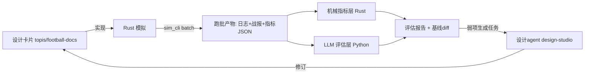

<!--
Project: my-ft
Created Date: 2026-06-12
Author: liming
Email: lmlala@aliyun.com
Copyright (c) 2025 FiuAI
-->

# EVAL — 评估管线：跑批模拟 + LLM 评估

> 回答「如何后期接入跑模拟、用 LLM 评估爽点/荒诞等关键指标」。
> 评估管线是设计闭环的另一半：设计卡片声明评估钩子 → 跑批产出数据
> → 评估打分 → 弱项变成新设计任务（喂给设计 agent，实现与设计见
> `studio/`）。

## 闭环总览

### EVAL-01 评估总架构与产物规范

状态: draft · 优先级: P0 · 依赖: ENG-05, ENG-04

**目的**：固定评估的输入输出契约，使任何设计/参数变更都能用同一把
尺子量「变好还是变坏」。

**设计理念**：两层分工——机械指标（Rust，免费，全量，每次跑）
负责分布与健康度；LLM 评估（Python，花钱，抽样，按需跑）负责
品味与主观质量。能用机械指标回答的绝不用 LLM（成本纪律）。

**如何设计**：
- 跑批命令：`sim_cli batch --seeds A..B --seasons N --profile <配置> --out runs/<实验名>/`；
- 每 seed 产物（固定 schema）：`logs.jsonl`（结构化日志全量）、
  `digest.md`（赛季战报，EVT-06 模板渲染）、`metrics.json`
  （EVAL-02 全指标）、`worldgen_report.json`（SEED-02 出厂报告）；
- 实验元数据：`manifest.json` = {git commit, 配置哈希, seed 区间,
  时间, 目的备注}——任何评估结果可复现实验；
- 基线机制：`runs/baseline/` 保存当前认可版本的产物；新实验自动
  与基线 diff，输出指标级红绿表；
- 评估报告统一格式：`report.md` + `report.json`（机器可读，供
  设计 agent 解析生成任务，EVAL-05）。

**验收标准**：
- [机器] 跑批产物 schema 校验；manifest 完整；断点续跑支持
  （单 seed 失败不毁全批）；
- [机器] 100 seed × 1 赛季（无 LLM）端到端 < 15 分钟（开发机）；
- [机器] 基线 diff 报告能按引擎归因（指标↔引擎映射表完备）。

**评估钩子**：
- 管线自身健康：跑批失败率、产物体积、各阶段耗时。

### EVAL-02 机械指标层（免费、全量）

状态: draft · 优先级: P0 · 依赖: EVAL-01

**目的**：用零成本统计量覆盖尽可能多的设计验收——全库设计卡片的
[机器] 类评估钩子的实现清单。

**设计理念**：机械指标是地基：LLM 评估只在机械指标健康的跑批上
进行（分布都不对时谈品味是浪费钱）。

**如何设计**：
- 指标家族（汇总自各卡片评估钩子，实现时按此清单核对）：
  叙事结构——事件类别熵、定义使用率与零触发清单（EVT-05）、
  cause 链长度分布（EVT-04）、记忆引用事件占比（ACT-03）、
  弧线数量/长度/收束分布（DIR-06）、张力曲线与包络相关性（DIR-02）；
  荒诞控制——absurdity 分布、2 级回响率、预算轨迹（DIR-04/WV-05）；
  社会模拟——派系生命周期、模块度序列（REL-03）、关系维度相关
  矩阵（REL-01）、三声望分歧度（REL-04）；
  比赛可信——MAT-06 全套校准带 KS/卡方检验；
  世界演化——冠军基尼、格局模式计数、跨赛季引用数（DIR-05）；
  体验代理——悬而未决事项序列（PSY-02）、每周决策数（UX-02）、
  曝光基尼（DIR-07）；
- 每指标定义四元组：{计算式, 健康带, 关联卡片 ID, 超带严重度}，
  存为数据文件（指标即配置，新增指标不改框架代码）；
- 红绿灯汇总：超带指标按严重度加权出跑批总分，进基线 diff。

**验收标准**：
- [机器] 指标↔卡片双向映射完备：每个 [机器] 评估钩子有指标实现，
  每个指标至少被一张卡引用（孤儿指标清理）；
- [机器] 全指标计算确定性（同跑批产物两次计算结果一致）；
- [机器] 指标计算总耗时 < 跑批本体的 20%。

**评估钩子**：
- （元）指标健康带的人工修订记录——健康带本身要随理解迭代。

### EVAL-03 LLM 评估层（爽点 / 荒诞 / 可复述性）

状态: draft · 优先级: P0 · 依赖: EVAL-01, EVAL-02

**目的**：量化机械指标够不着的主观质量：这个赛季的故事好不好看、
荒诞得是否可信、值不值得讲给别人。这是你点名的「LLM 评估爽点、
荒诞等关键指标」的落地设计。

**设计理念**：LLM-as-judge 的可靠性来自三件事：锚定样例的量表
（不让模型自由发挥标准）、多视角分项（不打总分大锅饭）、抽检
校准（人工与强模型定期对表）。中档模型跑量，强模型抽检。

**如何设计**：
- 评估维度量表（1-5 分，每分档配 2 个锚定样例，样例库随评估
  积累扩充）：
  S1 可复述性——「你会把这季的故事讲给朋友吗」（战报级）；
  S2 爽点密度——情绪峰值时刻的数量与强度（战报+事件链级）；
  S3 荒诞合理度——荒诞事件「离谱但讲得通」程度（事件级，
  对照 WV-05 样例库）；
  S4 因果可读性——凭日志能否重述前因后果（事件链级，ENG-04）；
  S5 角色一致性——行为与人格/记忆吻合度（人物级，ACT-01/05）；
  S6 节奏感——张弛有度 vs 流水账/轰炸（战报级，DIR-02）；
- 评估输入（按维度裁剪，控 token）：战报 digest.md（S1/S2/S6）、
  抽样事件链+因果展开（S3/S4）、人物事件流+人格卡（S5）；
- judge 输出强制 JSON：{维度分, 一句话理由, 最佳时刻引用,
  最差时刻引用}——「最差时刻」是设计金矿，直接进弱项报告；
- 选样策略：**由 Mentor 漏斗供给**（见 `15-mentor-storyline-funnel.md`：
  硬性条件树过滤 + 指纹去重/新颖度选样，LLM 只读 ≤ 5% 世界线；
  漏斗落地前的过渡期用随机抽 10-20% 兜底）；
  每月一次强模型对中档模型的评分抽检（相关性 < 0.7 时重校量表）；
- 模型配置：评估走中档模型（DeepSeek/Qwen 类，OpenAI 兼容接口，
  温度 0），单赛季全维度评估成本目标 < ¥0.5 [按当前价估算]；
- 防偏置：评估 prompt 不含「这是我做的游戏」语境；同批样本随机
  顺序；正负样例对照组定期插入（判别力体检）。

**验收标准**：
- [机器] judge 输出 JSON 解析成功率 ≥ 98%；同输入重复评估方差
  ≤ 0.3 分（温度 0 + 量表锚定的稳定性验证）；
- [机器] 判别力体检：人工构造的好/坏战报对照组，judge 区分准确率
  ≥ 85%；
- [人工] 每季度人工盲评 20 个样本与 judge 相关系数 ≥ 0.6。

**评估钩子**：
- （元）评估成本/跑批、维度分的版本间趋势线——游戏在变好吗，
  一张图回答。

### EVAL-04 蒙特卡洛跑批与实验方法

状态: draft · 优先级: P1 · 依赖: EVAL-01, SEED-05

**目的**：规范「改一个设计→验证效果」的实验方法学，防止跑批数据
被误读（样本不足、混淆变量、回归遗漏）。

**设计理念**：把游戏调参当 A/B 实验做：固定 seed 集做配对比较
（同 seed 改动前后对比，方差远小于随机抽样），变更单一化，效应
量优先于显著性。

**如何设计**：
- 标准实验流程：基线跑批（固定 seed 集 S，建议 |S|=100）→ 单一
  变更 → 同 S 重跑 → 配对 diff（指标级 + LLM 维度级）→ 结论入
  实验日志；
- seed 集分层：S 包含「黄金档 seed」（SEED-03）+ 随机段 + 历史
  问题 seed（曾暴露 bug/烂叙事的 seed 永久入集——回归测试的
  叙事版）；
- 扫参模式：SEED-05 参数网格 × 缩减 seed 集（|S|=20）粗扫 →
  最优区重点细扫（算力经济）；
- 多赛季实验：世界线类设计（DIR-05）必须用 ≥ 5 赛季跑批验证，
  单赛季指标对长线设计无效力；
- 实验日志：`runs/EXPERIMENTS.md` 追加式记录 {日期, 假设, 变更,
  结果, 决策}——你的设计决策审计轨迹，也是设计 agent 的历史
  上下文（设计 agent 的上下文组装机制）。

**验收标准**：
- [机器] 配对 diff 工具可用：两次跑批产物输入，输出按 seed 配对
  的指标变化分布；
- [机器] 问题 seed 集机制运转：标记的 seed 自动进入后续所有基线
  跑批；
- [人工] 实验日志格式被遵守（抽查近 10 条记录完整性）。

**评估钩子**：
- 实验吞吐量（每周完成的设计验证数——副业节奏的现实测量）。

### EVAL-05 评估→设计任务回写（mentor 闭环）

状态: draft · 优先级: P1 · 依赖: EVAL-02, EVAL-03

**目的**：让评估报告自动变成设计 agent 的工作队列——「mentor」
角色的机制化：模拟数据指出弱在哪，agent 去精修对应卡片。

**设计理念**：报告必须落到卡片 ID 才可行动：「S6 节奏感 3.1 分」
没法干活，「DIR-02 的 mid_crisis 阶段张力实测低于包络 30%，
关联最差时刻样例 ×3」才是任务。指标↔卡片映射（EVAL-02）是
回写的路由表。

**如何设计**：
- 弱项识别规则：机械指标超带（按严重度排序）+ LLM 维度分 < 3.5
  的样本聚类（按「最差时刻」的事件类别/引擎归因聚类）+ 漏斗 L1
  的 Reject 样本与高新颖度低分样本（15-mentor §6）；
- 任务卡生成（写入 `topis/tasks/` 队列，schema 与 agent 的
  任务消费协议对齐，见 `docs/`）：
  {目标卡片 ID, 证据（指标值/样例引用）, 期望方向, 优先级,
  生成时间}；
- 人工闸门：任务队列默认由你晨检 5 分钟批准/丢弃后 agent 才执行
  （副业节奏：评估夜里跑，任务早上批，agent 白天改，你晚上
  review——24 小时一圈的个人流水线）；
- 防振荡：同一卡片 30 日内被回写任务 ≥ 3 次时冻结并标记
  「needs-human」（与设计 agent 的振荡冻结同款机制）——反复修不好
  说明问题在别处。

**验收标准**：
- [机器] 弱项→任务卡转化全自动；任务卡 100% 携带证据引用；
- [机器] 振荡冻结机制单测通过；
- [人工] 试运行 2 周：任务批准率 ≥ 50%（过低 = 弱项识别噪声大，
  规则要修）。

**评估钩子**：
- 任务关闭后对应指标的改善率（mentor 闭环的有效性自证）。

### EVAL-06 成本与算力预算

状态: draft · 优先级: P2 · 依赖: EVAL-03, EVAL-04

**目的**：把评估的钱花在刀刃上——副业项目的 API 成本必须可预测、
可封顶。

**设计理念**：成本结构设计优先于省钱技巧：机械指标全量免费、
LLM 抽样、强模型仅校准——三层结构本身就是成本控制。

**如何设计**：
- 月度预算封顶：LLM 评估 ≤ ¥150/月 [按需调整]，超限自动降抽样率
  并告警；
- 省钱清单：战报先压缩再评估（评 digest 不评全日志）、量表与
  样例库进 system prompt 享受缓存定价、同版本重复 seed 评估结果
  缓存复用、批量接口（off-peak 折扣）跑夜批；
- 成本记账：每次跑批 manifest 记录 token 消耗与折算金额，月度
  汇总进实验日志；
- 升级路径：若后期接入本地模型（Qwen 本地部署），评估层接口
  不变只换 endpoint（OpenAI 兼容约定的红利）。

**验收标准**：
- [机器] 预算封顶与降级逻辑可测；成本记账与账单核对误差 < 10%；
- [人工] 连续 3 个月成本在预算内且评估吞吐满足设计节奏。

**评估钩子**：
- 每「有效设计修订」的平均评估成本（效率北极星）。
